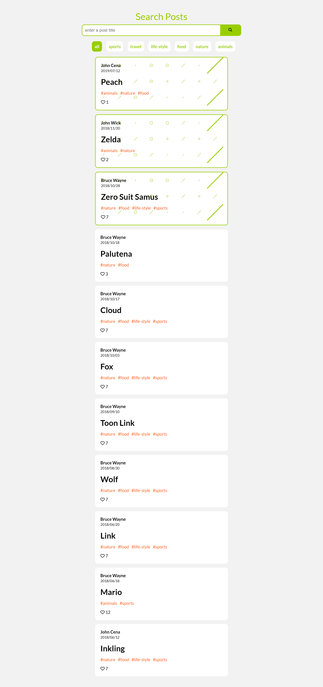
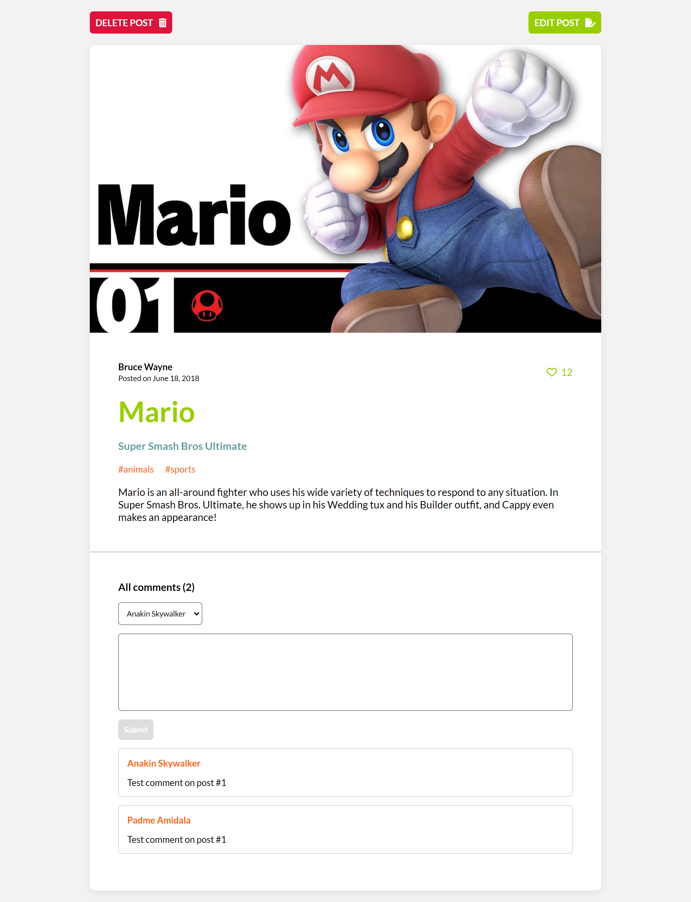
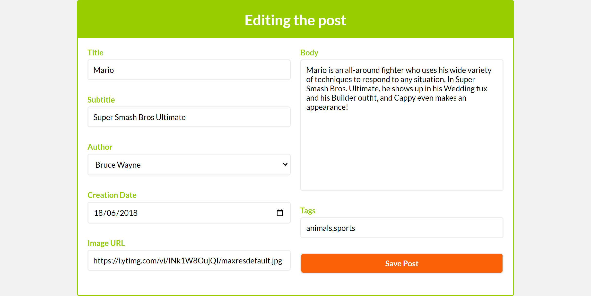

# Homework Week 3

## Description

The homework consists of deploying json-server to the glitch platform and using it as a backend to interact with the post's data stored in the db.json file by creating a frontend app that allows the user to search for blogs by title and by tags, also view the details of a particular post and be able to modify it and add likes to it.

## Live Site

[Vercel Deployment](https://homework-week-3.vercel.app/)

## Built With

- Semantic HTML5 markup
- CSS Flexbox
- Media Queries
- Desktop-First approach
- CSS Custom Properties
- JavaScript Basics
- Fetch API (GET, POST, PATCH, DELETE)
- Singleton Design Pattern
- json-server deployed to glitch as a backend
- Basic Event Handling
- Basic DOM Manipulation

## Visuals

**Screenshot Desktop 1**

**Screenshot Desktop 2**

**Screenshot Desktop 3**

